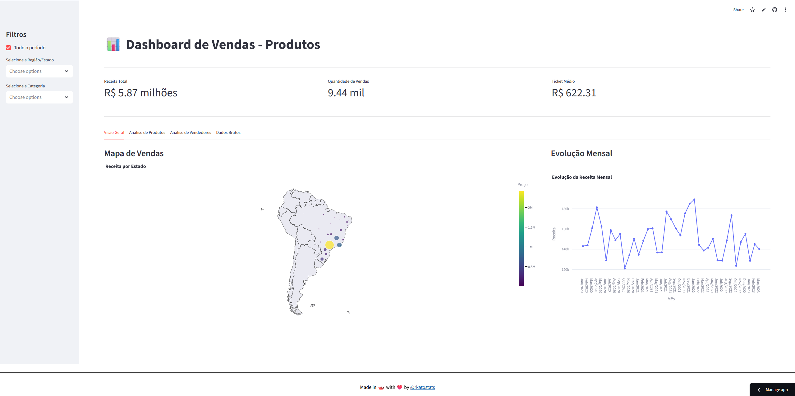

# 📊 Dashboard de Vendas - Produtos

Este projeto consiste em um dashboard interativo desenvolvido em Python utilizando a biblioteca **Streamlit**. O objetivo é visualizar e analisar dados de vendas de produtos, oferecendo insights sobre receita, desempenho de vendedores e distribuição geográfica das vendas.

O projeto foi desenvolvido durante o curso "Streamlit: construindo um dashboard interativo" da **Alura**.

O projeto está disponível para uso na plataforma da **Streamlit**: https://dashboard-vendas-curso-alura-rkato.streamlit.app/ 



## 🚀 Funcionalidades

O dashboard oferece uma interface intuitiva com as seguintes funcionalidades:

### 🎛️ Filtros (Sidebar)
Permite refinar a análise dos dados através de filtros dinâmicos:
*   **Ano:** Seleção de um intervalo de anos ou visualização de todo o período.
*   **Região/Estado:** Seleção múltipla de regiões geográficas.
*   **Categoria do Produto:** Seleção múltipla de categorias de produtos.

### 📈 Indicadores Chave (KPIs)
Exibição destacada de métricas essenciais:
*   Receita Total
*   Quantidade de Vendas
*   Ticket Médio

### 📑 Abas de Análise
O conteúdo é organizado em quatro abas principais:

1.  **Visão Geral:**
    *   **Mapa de Vendas:** Visualização geoespacial da receita por estado.
    *   **Evolução Mensal:** Gráfico de linha mostrando a evolução da receita ao longo do tempo.

2.  **Análise de Produtos:**
    *   **Receita por Categoria:** Gráfico de barras comparando o desempenho das categorias.
    *   **Top 5 Estados:** Ranking dos estados com maior receita.

3.  **Análise de Vendedores:**
    *   **Top Vendedores (Receita):** Ranking dos vendedores que geraram mais receita.
    *   **Top Vendedores (Quantidade):** Ranking dos vendedores com maior volume de vendas.
    *   *Opção para ajustar a quantidade de vendedores exibidos no ranking.*

4.  **Dados Brutos:**
    *   Visualização da tabela completa com os dados filtrados.
    *   **Download:** Botão para exportar os dados filtrados em formato CSV.

## 🛠️ Tecnologias Utilizadas

*   **[Python](https://www.python.org/):** Linguagem base do projeto.
*   **[Streamlit](https://streamlit.io/):** Framework para criação do dashboard interativo.
*   **[Pandas](https://pandas.pydata.org/):** Manipulação e análise de dados.
*   **[Plotly Express](https://plotly.com/python/plotly-express/):** Criação de gráficos interativos.
*   **[Requests](https://pypi.org/project/requests/):** Consumo de dados via API.
*   **[Htbuilder](https://pypi.org/project/htbuilder/):** Auxílio na construção do rodapé personalizado.

## 📂 Estrutura do Projeto

*   `Dashboard.py`: Arquivo principal da aplicação.
*   `fn_carregar_dados.py`: Função responsável por buscar e armazenar em cache os dados da API.
*   `fn_formatar_valores.py`: Função utilitária para formatação de valores monetários e numéricos.
*   `fn_footer.py`: Componente para renderização do rodapé da página.
*   `requirements.txt`: Lista de dependências do projeto.

## ⚙️ Como Executar

1.  **Clone o repositório:**
    ```bash
    git clone https://github.com/seu-usuario/seu-repositorio.git
    cd seu-repositorio
    ```

2.  **Crie e ative um ambiente virtual (opcional, mas recomendado):**
    ```bash
    # Windows
    python -m venv venv
    .\venv\Scripts\activate

    # Linux/Mac
    python3 -m venv venv
    source venv/bin/activate
    ```

3.  **Instale as dependências:**
    ```bash
    pip install -r requirements.txt
    ```

4.  **Execute o dashboard:**
    ```bash
    streamlit run Dashboard.py
    ```

5.  O dashboard será aberto automaticamente no seu navegador padrão.

## ℹ️ Créditos

*   **Desenvolvedor:** Rodrigo Kato (rkato.stats@gmail.com)
*   **Instrutor:** João Vitor de Miranda (Alura)
*   **Fonte de Dados:** [LabDados](https://labdados.com/produtos)
